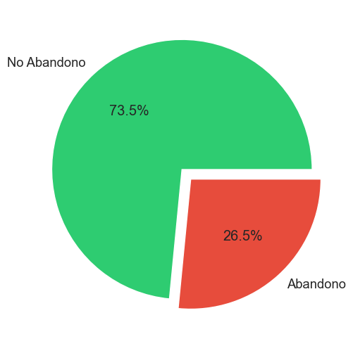
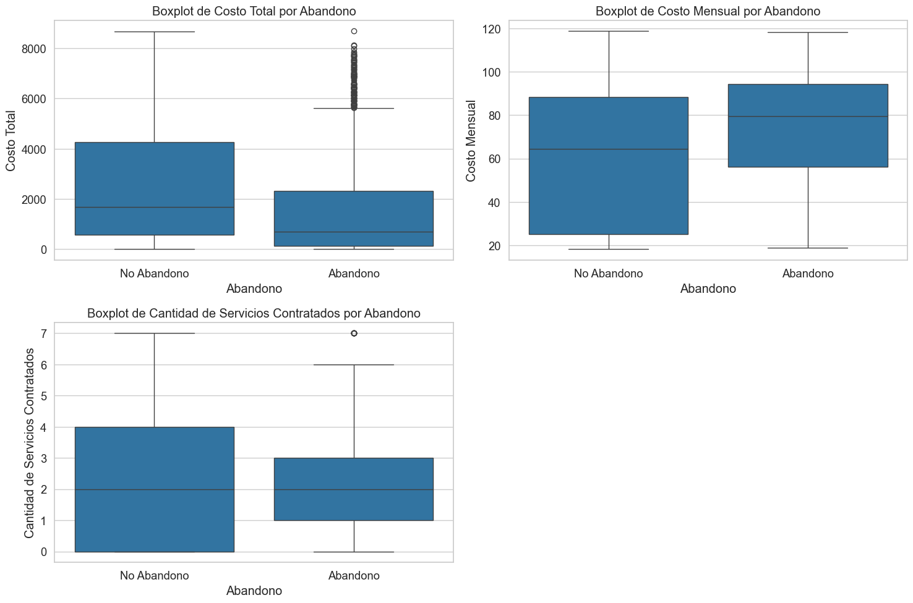
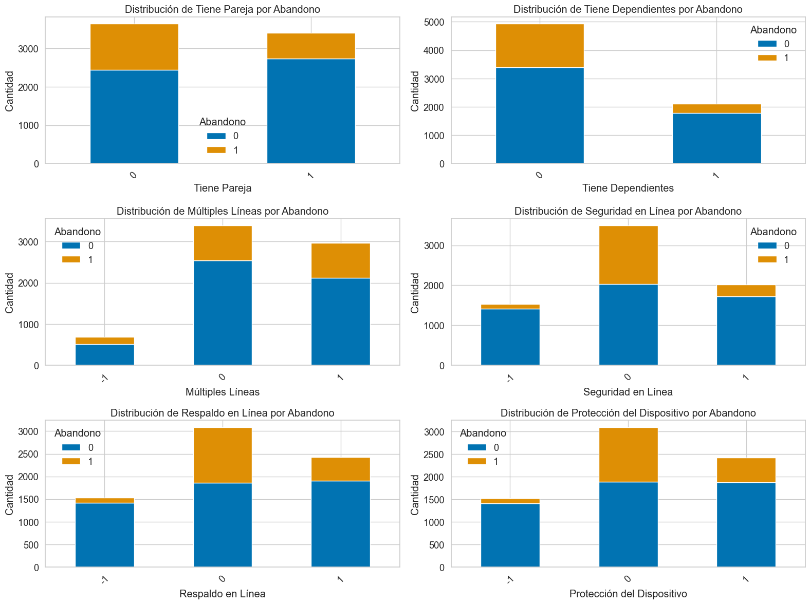
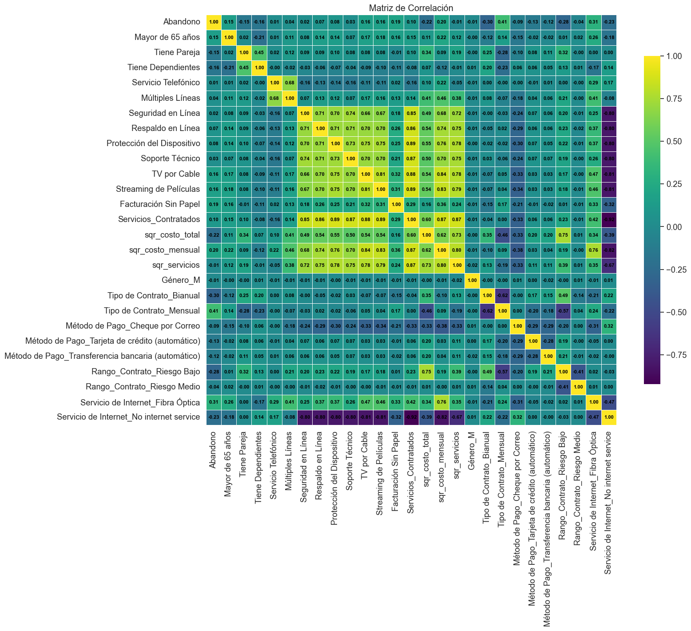
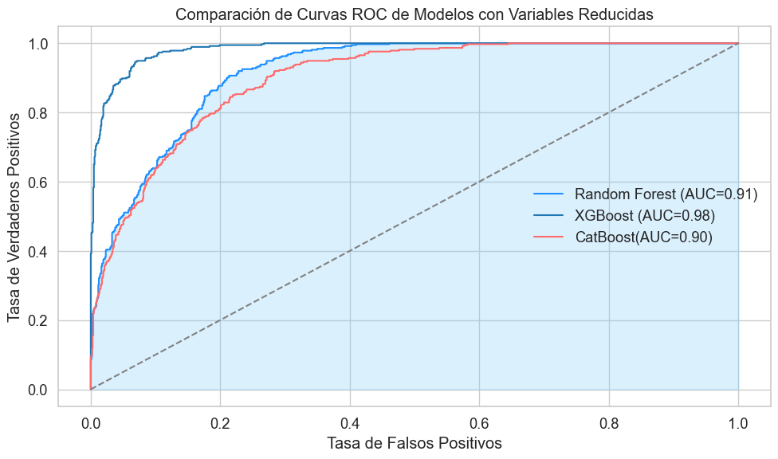

# Challenge Telecom X – Parte 2: Predicción de Cancelación (Churn)

## 🎯Descripción del Proyecto

Desarrollar un modelo predictivo para identificar clientes con alto riesgo de cancelación de servicios, permitiendo a la empresa tomar acciones preventivas y estratégicas para reducir la tasa de abandono y optimizar la retención de clientes.


## 📊 Objetivos del Desafío
* Preparar los datos para el modelado (tratamiento, codificación, normalización).

* Realizar análisis de correlación y selección de variables.

* Entrenar dos o más modelos de clasificación.

* Evaluar el rendimiento de los modelos con métricas.

* Interpretar los resultados, incluyendo la importancia de las variables.

* Crear una conclusión estratégica señalando los principales factores que influyen en la cancelación.

### Componentes principales
* Análisis exploratorio de datos
* Preprocesamiento e ingenieria de caracteristicas
* Modelado predictivo de clasificación
* Evaluación de factores de riesgo de cancelación

## Estructura del proyecto

- **TelecomX_LATAM.ipynb**: Notebook principal con todo el proceso de análisis, desde la carga y limpieza de datos hasta la visualización y conclusiones.
- **datos_tratados**: Fuente de datos tratados en proyecto anterior. 
- **modelo_xgboost_reducido.plk**: Modelo XGBOOST generado
- **Informe TelecomX - Parte 2.pdf**: Informe detallado sobre resultados y hallazgos

### Datos iniciales 
```
Data columns (total 24 columns):
 #   Column                             Non-Null Count  Dtype  
---  ------                             --------------  -----  
 0   ID Cliente                         7043 non-null   object 
 1   Abandono                           7043 non-null   int64  
 2   Género                             7043 non-null   object 
 3   Mayor de 65 años                   7043 non-null   bool   
 4   Tiene Pareja                       7043 non-null   int64  
 5   Tiene Dependientes                 7043 non-null   int64  
 6   Duración del Contrato (meses)      7043 non-null   int64  
 7   Servicio Telefónico                7043 non-null   int64  
 8   Múltiples Líneas                   7043 non-null   int64  
 9   Servicio de Internet               7043 non-null   object 
 10  Seguridad en Línea                 7043 non-null   int64  
 11  Respaldo en Línea                  7043 non-null   int64  
 12  Protección del Dispositivo         7043 non-null   int64  
 13  Soporte Técnico                    7043 non-null   int64  
 14  TV por Cable                       7043 non-null   int64  
 15  Streaming de Películas             7043 non-null   int64  
 16  Tipo de Contrato                   7043 non-null   object 
 17  Facturación Sin Papel              7043 non-null   int64  
 18  Método de Pago                     7043 non-null   object 
 19  Costo Mensual                      7043 non-null   float64
 20  Costo Total                        7043 non-null   float64
 21  Costo Diario                       7043 non-null   float64
 22  Rango de Contrato                  7043 non-null   object 
 23  Cantidad de Servicios Contratados  7043 non-null   int64  
```

## Índice de Contenidos de TelecomX_LATAM.ipynb

### 1. Preparación de Datos
- 1.1 Carga y Exploración Inicial: Se presenta la composición de los datos, identificando la clase principal.
- 1.2 Limpieza y Preparación de Datos: Se identifican y analizan variables relevantes, describiendo sus asimetrías y características de distribución. También se incluye el análisis de variables binarias y servicios adicionales, destacando su relación con la probabilidad de abandono y la importancia de algunos servicios.
- 1.3 Análisis de Gráficos para Variables Numéricas: Se identifican y analizan variables relevantes, describiendo sus asimetrías y características de distribución. También se incluye el análisis de variables binarias y servicios adicionales, destacando su relación con la probabilidad de abandono y la importancia de algunos servicios.
-  1.4 Gráficos de Variables Categóricas:Se identifican y analizan variables categóricas, destacando su relación con cancelación del servicio.
- 1.5 Información Mutua: Se aplica la técnica para medir la dependencia entre dos variables e identificar características por su relevancia, esto nos permitirá simplificar el modelo se ser necesario.
- 1.6 Detección y Tratamiento de Outliers: Se aplican transformaciones (logarítmica, Box-Cox y raíz cuadrada) que nos ayudan a identificar y transformar valores atípicos que pueden distorsionar el análisis estadístico y el rendimiento de modelos.
- 1.7 Codificación de Variables Categóricas: Se identifican las correlaciones positivas y negativas de diversas variables con la probabilidad de abandono.










### 2. Preprocesamiento
- 2.1 Separación de Datos: Dividir el conjunto de datos en subconjuntos para entrenamiento, validación y prueba en una proporción 80% entrenamiento, 20% prueba. 
- 2.2 Balanceo de Clases: Aunque se evidencia un desbalanceo, no se aplica ninguna tácnica de balanceo debido a que la relación de desbalanceo (2.77) se considera moderada (no crítica) y se puede tratar en el modelado.

### 3. Entrenamiento de Modelos
- 3.1 Selección de Algoritmos: Selección de acuerdo al tipo de problema a resolver y caracteristicas de los datos, en este caso es un problema de clasificación. Se propone: Random Forest, CatBoost y XGBoost.
- 3.2 Random Forest: Robusto contra overfitting, maneja bien features no lineales, bueno con datasets desbalanceados, menos sensible a outliers.
- 3.3 CatBoost. Bueno con variables categóricas, reduce sesgo por codificación, mejor rendimiento con pocos datos.
- 3.4 XGBoost. Mayor precisión predictiva, regularización integrada, más rápido computacionalmente y maneja muy bien la probabilidad de abandono

### 4. Evaluación de Modelos
(Accuracy, Precision, Recall, F1-score, Matriz de confusión)
- 4.1 Métricas Random Forest.
- 4.2 Métricas CatBoost
- 4.3 Métricas XGBoost

### 5. Ajuste de Modelos
(Se realizan ajustes al algoritmo para mejorar el rendimiento observado en la evaluación)
- 5.1 Random Forest. 
- 5.2 CatBoost.
- 5.3 XGBoost.
- 5.4 Evaluación de Modelos Ajustados. Se observa una mejora en el rendimiento respecto al primer modelo entrenado en los tres algoritmnos.
- 5.5 Análisis de Overfitting. Se evalua la capacidad de generalización de los modelos.
- 5.6 Validación Cruzada. Se hace para mejorar la estimación de rendimiento y validar la capacidad de generalización.
- 5.7 Dataframe de Variables Reducidas. Se propone reducir la cantidad de variables reducir la complejidad del dataset y luego volver a evaluar los algortimos. Se objerva un amejora significativo en todos, especialmente en XGBoost. 
- 5.8 Ajuste de Umbral. Despues de  observar el ROC se realiza un ajuste de 0.4 para reducir los falsos negativos. 

### 6. Interpretación
- 6.1 Análisis de Variables Relevantes XGBoost Se revisan las variables mas relevantes para la predicción de cancelación en el modelo XGBoost reducido (el cual ha sido el modelo con mejores resultados).
- 6.2 Análisis Complementario Random Forest. se hace un análisis complementario para identificar los factores críticos que influyen en la deserción de clientes y desarrollar estrategias de retención más efectivas y personalizadas. 

### 7. Anexos
- Se genera el modelo seleccionado y entrenado: modelo_xgboost_reducido.pkl
- Se realiza una conclusión del procedimiento y los resultados obtenidos.

## Requisitos

- Python 3.x
- Pandas
- Matplotlib
- Seaborn
- Scikit-learn (sklearn)
- Catboost
- XGBoost
- Jupyter Notebook

## Uso

1. Clona este repositorio.
2. Abre el archivo `TelecomX_LATAM.ipynb` en Jupyter Notebook o Google Colab.
3. Ejecuta las celdas para reproducir el modelado

---
## Uso de modelo entrenado
Para utilizar modelo_xgboost_reducido.pkl en el contexto de predicción de cancelación (churn) de Telecom siga los siguientes pasos:
1. Cargar el modelo entrenado modelo_xgboost_reducido.pkl en el entorno de Python usando la librería pickle.

```
import pickle

# Guardar modelo
with open('modelo_xgboost_reducido.pkl', 'wb') as archivo:
    pickle.dump(modelo, archivo)

# Cargar modelo
with open('modelo_xgboost_reducido.pkl', 'rb') as archivo:
    modelo_cargado = pickle.load(archivo)
```
2. Cargar los nuevos datos para predicción.
3. Preparar los nuevos datos de la misma manera que los datos de entrenamiento.
    - Limpieza de datos: Eliminar 'ID Cliente', 'Costo Diario' y 'Duración del Contrato (meses)'.
    - Tratamiento de variables numéricas.
    - Codificación de variables categóricas y binarias.
    - Selección y reducción de variables: Dado que el modelo XGBoost se optimizó con un "Dataframe de variables reducidas", es imprescindible que los nuevos datos contengan solo las variables relevantes que fueron seleccionadas para el modelo final.
4. Realizar predicciones:
    - Una vez que los nuevos datos estén completamente preparados y tengan la misma estructura y características que los datos de entrenamiento, podrás pasarlos al modelo cargado para obtener las predicciones de churn.
    - Considera aplicar en el análisis de la curva ROC el umbral a las probabilidades de predicción.
```
# Predecir
predicciones = modelo_cargado.predict(X_test_nuevos)
probabilidades = modelo_cargado.predict_proba(X_test_nuevos)
```
   
5. Interpretar los resultados. para entender qué factores están influyendo en las predicciones de churn para los nuevos clientes.

**Autor:** Ana Sayago  
